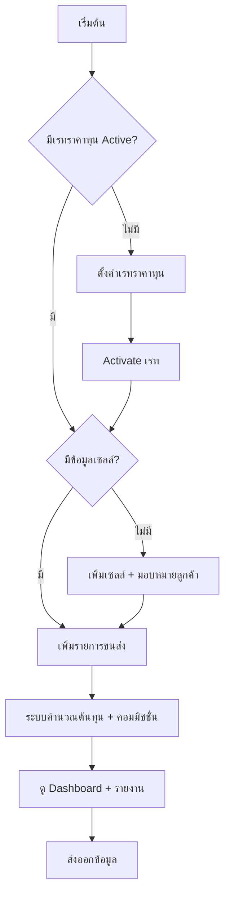

# 📦 Commission Cargo - คู่มือการใช้งานระบบ

## 🔐 1. การเข้าสู่ระบบ (Login)

```
ผู้ใช้เปิดเว็บไซต์ → หน้า Login → กรอก Email/Password → เข้าสู่ Dashboard
```

### บทบาทผู้ใช้ (User Roles)
| Role | สิทธิ์การใช้งาน |
|------|----------------|
| **ADMIN** | เข้าถึงทุกฟีเจอร์, จัดการผู้ใช้, จัดการเรทราคาทุน, จัดการเซลล์ |
| **MANAGER** | จัดการเรทราคาทุน, จัดการเซลล์, ดูรายงานทั้งหมด |
| **STAFF** | เพิ่มรายการขนส่ง, ดูรายงาน |
| **SALE** | ดูเฉพาะรายการของตัวเอง |

---

## 🚀 2. Flow การตั้งค่าเริ่มต้น (One-time Setup)

### 2.1 ตั้งค่าเรทราคาทุน (Rate Card)
```
เมนู "เรทราคาทุน" → เพิ่มเรทใหม่ → กรอกชื่อเรท → กำหนดราคาแต่ละประเภทสินค้า → บันทึก → Activate
```

**ประเภทสินค้า:**
- **GENERAL** - สินค้าทั่วไป
- **TISI** - สินค้า มอก.
- **FDA** - สินค้าอาหาร/ยา
- **SPECIAL** - สินค้าพิเศษ

**ต้องกรอกราคา 4 ช่อง/ประเภท:**
| ช่อง | คำอธิบาย |
|------|---------|
| Truck/CBM | ราคาขนส่งรถ ต่อ CBM |
| Truck/KG | ราคาขนส่งรถ ต่อ กก. |
| Ship/CBM | ราคาขนส่งเรือ ต่อ CBM |
| Ship/KG | ราคาขนส่งเรือ ต่อ กก. |

### 2.2 ตั้งค่าเซลล์ (Salesperson)
```
เมนู "ตั้งค่าเซลล์" → เพิ่มเซลล์ใหม่ → กรอกข้อมูล (รหัส, ชื่อ, เบอร์, อีเมล) → บันทึก
```

**ข้อมูลเซลล์:**
- รหัสเซลล์ (เช่น S-01, SALE-01)
- ชื่อ-นามสกุล
- เบอร์โทรศัพท์
- อีเมล

### 2.3 มอบหมายลูกค้าให้เซลล์
```
หน้าตั้งค่าเซลล์ → คลิกไอคอน "จัดการลูกค้า" → กรอกรหัสลูกค้า → เพิ่ม
```

---

## 📋 3. Flow การเพิ่มรายการขนส่ง (Daily Operation)

### 3.1 เพิ่มรายการขนส่งใหม่
```
เมนู "รายการขนส่ง" → เพิ่มรายการใหม่ (หรือ "นำเข้าหลายรายการ") → กรอกข้อมูล → บันทึก
```

### 3.1.1 การนำเข้าหลายรายการ (Bulk Import)
1. กดปุ่ม "นำเข้าหลายรายการ"
2. คัดลอกข้อมูลจาก Excel (ต้องเรียงคอลัมน์ตามที่กำหนด)
3. วางลงในช่องรับข้อมูล
4. กด "ตรวจสอบข้อมูล" เพื่อดูตัวอย่างรายการ
5. กด "ยืนยันการนำเข้า" เพื่อบันทึกทั้งหมดทันที

**ข้อมูลที่ต้องกรอก:**

| ฟิลด์ | คำอธิบาย | ตัวอย่าง |
|-------|---------|---------|
| **วันที่นำเข้า** | วันที่รับสินค้า | 18/01/2026 |
| **รหัสลูกค้า** | รหัสลูกค้าในระบบ | PR-001 |
| **เลขพัสดุ** | Tracking Number | TH12345678 |
| **ประเภทสินค้า** | GENERAL/TISI/FDA/SPECIAL | GENERAL |
| **ประเภทขนส่ง** | ทางบก/ทางเรือ | ทางบก |
| **น้ำหนัก (กก.)** | น้ำหนักสินค้า | 15.5 |
| **ปริมาตร (CBM)** | ขนาด CBM | 0.125 |
| **ราคาขาย** | ราคาที่เก็บจากลูกค้า | 2,500 |
| **โหมดต้นทุน** | AUTO/MANUAL | AUTO |

### 3.2 การคำนวณอัตโนมัติ

**เมื่อโหมดต้นทุน = AUTO:**
```
ต้นทุน = MAX(CBM × rate_cbm, KG × rate_kg)
```

**ตัวอย่าง:**
- สินค้า GENERAL, ขนส่งรถ
- น้ำหนัก: 15.5 กก., CBM: 0.125
- Rate: CBM = 900 บาท, KG = 60 บาท
- คำนวณ: MAX(0.125 × 900, 15.5 × 60) = MAX(112.5, 930) = **930 บาท**
- ใช้กฎ **KG** เพราะให้ค่ามากกว่า

### 3.3 การคำนวณคอมมิชชั่น
กรณีปกติจะใช้ส่วนต่างราคา แต่ถ้าเป็นเคส Break-even จะได้ 1%

**วิธีส่วนต่าง (DIFF):**
```
เมื่อ ราคาขาย ≠ ต้นทุน
คอมมิชชั่น = ราคาขาย - ต้นทุน
(ค่าอาจจะเป็นลบได้ หากขาดทุน)
```

**วิธี 1% ยอดขาย (ONEPCT):**
```
เมื่อ ราคาขาย = ต้นทุน (Break-even)
คอมมิชชั่น = ราคาขาย × 1%
```

### 3.4 การแก้ไขและลบรายการ
- **แก้ไข:** กดปุ่มเมนู (3 จุด) หลังรายการที่ต้องการ → เลือก "แก้ไขข้อมูล" → บันทึก
- **ลบ:** กดปุ่มเมนู (3 จุด) หลังรายการที่ต้องการ → เลือก "ลบรายการ" → ยืนยัน


---

## 📊 4. Flow การดูรายงาน

### 4.1 Dashboard (ศูนย์ควบคุม)
```
เมนู "แดชบอร์ด" → ดูภาพรวมระบบ
```

**ข้อมูลที่แสดง:**
- 💰 คอมมิชชั่นรวมเดือนนี้
- 📦 ต้นทุนรวมเดือนนี้
- 💵 ยอดขายรวมเดือนนี้
- 📈 จำนวนรายการทั้งหมด
- 📉 กราฟย้อนหลัง 6 เดือน
- ⚠️ รายการที่ต้องตรวจสอบ

### 4.2 รายงานสรุป
```
เมนู "รายงานสรุป" → เลือกเดือน → ดูรายงาน/ส่งออก
```

### 4.3 ประวัติการใช้งาน (Audit Log)
```
เมนู "ประวัติการใช้งาน" → ดู log การทำงานของระบบ
```

---

## 🔄 5. Flow การทำงานประจำวัน



---

## 📱 6. สถานะรายการขนส่ง

| สถานะ | สี | ความหมาย |
|-------|-----|---------|
| ✅ **ปกติ** | เขียว | ราคาขาย > ต้นทุน (มีกำไร) |
| ⚠️ **รอเรทราคา** | เหลือง | ไม่มีเรท Active หรือต้นทุน = 0 |
| ❌ **ขาดทุน** | แดง | ต้นทุน > ราคาขาย |

---

## 🛠️ 7. การจัดการปัญหาที่พบบ่อย

### ปัญหา: รายการแสดงสถานะ "รอเรทราคา"
**สาเหตุ:** ไม่มี Rate Card ที่ Active
**แก้ไข:** ไปที่ "เรทราคาทุน" → สร้างหรือ Activate เรท

### ปัญหา: คอมมิชชั่นแสดงติดลบ
**สาเหตุ:** ราคาขายต่ำกว่าต้นทุน
**แก้ไข:** ตรวจสอบราคาขายหรือใช้โหมดต้นทุน MANUAL

### ปัญหา: ไม่พบเซลล์ในรายการขนส่ง
**สาเหตุ:** ลูกค้าไม่ได้ถูกมอบหมายให้เซลล์
**แก้ไข:** ไปที่ "ตั้งค่าเซลล์" → มอบหมายลูกค้าให้เซลล์

---

## 📞 8. ข้อมูลติดต่อ

หากพบปัญหาในการใช้งาน สามารถติดต่อ:
- 📧 Email: support@prcargo.com
- 📱 Line: @prcargo

---

*อัปเดตล่าสุด: 18 มกราคม 2026*
